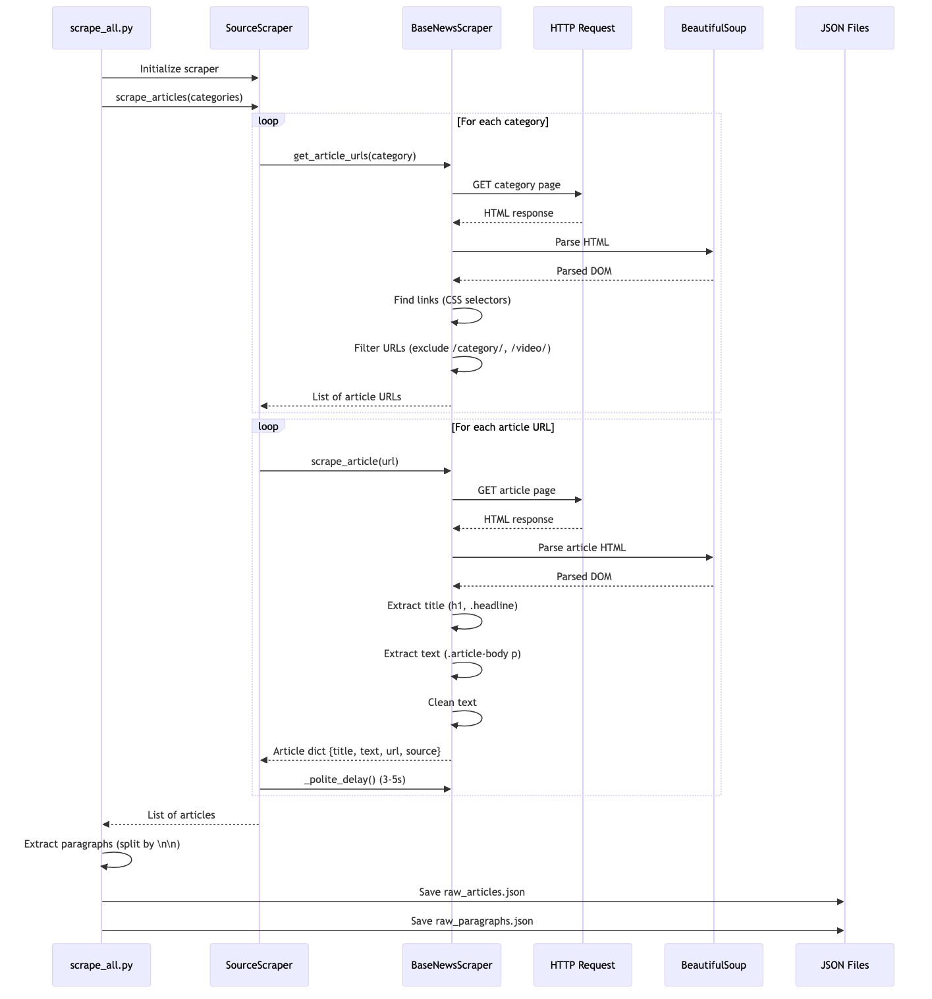

# NER Prompt Engineering Project - COMP 451 Project #2

This project evaluates Named Entity Recognition (NER) performance using prompt engineering with multiple Large Language Models (LLMs).

## Project Overview

- **4 LLMs**: llama3.1:8b, gemma2:27b, mistral:7b-instruct, qwen2.5:14b (all via Ollama)
- **3 Prompt Styles**: Zero-shot, Few-shot (5 examples), Chain-of-Thought
- **12 Combinations**: All model × prompt combinations evaluated
- **Core Dataset**: 140 sentences sampled from OntoNotes5 (MISC labels converted to O)
- **Target NER Classes**: PERSON, ORGANIZATION, LOCATION, TIME, CURRENCY
- **Web Scraping**: News paragraphs from Fox News and Vice (424 paragraphs, refined to 140 selected samples)

## Setup

1. Install dependencies:
```bash
pip install -r requirements.txt
```

2. Install and set up Ollama:
```bash
# Install Ollama from https://ollama.ai
ollama pull llama3.1:8b
ollama pull gemma2:27b
ollama pull mistral:7b-instruct
ollama pull qwen2.5:14b
```

3. Ensure Ollama is running:
```bash
ollama serve
# Or run in background:
ollama serve > /dev/null 2>&1 &
```

## Usage

### Running Experiments

Experiments are run via Jupyter notebooks in the `experiments/` directory:

1. **Individual Model Experiments**: 
   - `llama3.1_8b_simplified.ipynb`
   - `gemma2:27b.ipynb`
   - `mistral:7b-instruct.ipynb`
   - `qwen2.5:14b.ipynb`

   Each notebook runs zero-shot, few-shot, and chain-of-thought experiments on Dataset 1 (140 samples).

2. **Compile All Results**:
```bash
cd experiments
python compile_all_results.py
```

This generates comparison plots and summary CSV files in `experiments/results/`.

3. **Annotate Dataset2**:
   - Use `experiments/annotate_dataset2_gemma2_27b_fewshot.ipynb`
   - This uses the best-performing model (gemma2:27b) with Few-Shot prompting
   - Input: `dataset2/selected_140_samples.json`
   - Output: `dataset2/final_annotated.json`

### Web Scraping

```bash
cd scraping
bash run_scraping.sh
# Or directly:
python scraping/scrape_all.py
```

This will scrape news articles from Fox News and Vice, saving:
- Full articles: `dataset2/raw_articles.json`
- Paragraphs: `dataset2/raw_paragraphs.json`

**Scraping Sources:**
- **Fox News**: https://www.foxnews.com (Politics, Business, World categories)
- **Vice**: https://www.vice.com/en/tag/politics/

**Scraping Architecture:**



## Project Structure

```
ner_nlp/
├── experiments/
│   ├── llama3.1_8b_simplified.ipynb      # Llama 3.1 8B experiments
│   ├── gemma2:27b.ipynb                  # Gemma2 27B experiments
│   ├── mistral:7b-instruct.ipynb         # Mistral 7B experiments
│   ├── qwen2.5:14b.ipynb                 # Qwen2.5 14B experiments
│   ├── annotate_dataset2_gemma2_27b_fewshot.ipynb  # Dataset2 annotation
│   ├── compile_all_results.py            # Compile comparison results
│   └── results/                          # All experiment results
│       ├── all_models_comparison_summary.csv        # Token-level metrics
│       ├── all_models_spacy_comparison_summary.csv  # Entity-level metrics
│       ├── all_models_f1_comparison.png             # F1 comparison plots
│       ├── all_models_precision_comparison.png      # Precision plots
│       ├── all_models_recall_comparison.png         # Recall plots
│       └── all_models_accuracy_comparison.png       # Accuracy plots
├── scraping/
│   ├── scrape_all.py                     # Main scraping orchestrator
│   ├── scrape_vice.py                    # Vice-specific scraper
│   ├── rescrape_foxnews.py               # Fox News scraper
│   └── run_scraping.sh                   # Easy execution script
├── data/
│   ├── selected_140_ontonotes5_samples_no_misc.json  # Final Dataset 1
│   ├── convert_to_simplified_labels.py   # Remove BIO tags
│   └── convert_misc_to_o.py              # Convert MISC to O
├── dataset2/
│   ├── selected_140_samples.json         # Input for annotation
│   └── final_annotated.json              # Final annotated dataset
└── configs/
    └── config.yaml                       # Configuration file (if needed)
```

## Dataset 1 Processing

The Dataset 1 (140 samples) was processed as follows:

1. **Selection**: 140 samples selected from OntoNotes5 using stratified sampling by sentence length and entity richness
2. **Label Simplification**: BIO tags (B-/I- prefixes) removed (e.g., `B-PERSON` → `PERSON`)
3. **MISC Removal**: All MISC labels converted to O (103 labels converted)

Final dataset: `data/selected_140_ontonotes5_samples_no_misc.json`

## Results

Results are saved in `experiments/results/` with both token-level and entity-level (spaCy) evaluation metrics.

### Results Files

- **Token-Level Metrics**: `all_models_comparison_summary.csv`
  - Metrics: F1, Precision, Recall, Accuracy
  - Evaluation: Token-by-token classification
  
- **Entity-Level Metrics** (spaCy): `all_models_spacy_comparison_summary.csv`
  - Metrics: F1, Precision, Recall
  - Evaluation: Strict entity span matching (complete entity must match)

- **Visualization Plots**: 
  - `all_models_f1_comparison.png` / `all_models_f1_spacy_comparison.png`
  - `all_models_precision_comparison.png` / `all_models_precision_spacy_comparison.png`
  - `all_models_recall_comparison.png` / `all_models_recall_spacy_comparison.png`
  - `all_models_accuracy_comparison.png` (token-level only)

### Entity-Level Results (spaCy) - Primary Metric

Entity-level F1 scores are the primary metric for model comparison (strict span matching):

| Model | Prompt Type | F1 | Precision | Recall |
|-------|-------------|-----|-----------|--------|
| **gemma2:27b** | **Few-Shot** | **0.7206** | **0.7215** | **0.7197** |
| gemma2:27b | Zero-Shot | 0.6713 | 0.7446 | 0.6111 |
| gemma2:27b | Chain-of-Thought | 0.6180 | 0.5962 | 0.6414 |
| qwen2.5:14b | Few-Shot | 0.6725 | 0.6709 | 0.6742 |
| qwen2.5:14b | Zero-Shot | 0.6528 | 0.7217 | 0.5960 |
| qwen2.5:14b | Chain-of-Thought | 0.6364 | 0.6551 | 0.6187 |
| llama3.1:8b | Few-Shot | 0.6499 | 0.6459 | 0.6540 |
| llama3.1:8b | Zero-Shot | 0.5919 | 0.6119 | 0.5732 |
| llama3.1:8b | Chain-of-Thought | 0.6005 | 0.6400 | 0.5657 |
| mistral:7b-instruct | Zero-Shot | 0.5368 | 0.5604 | 0.5152 |
| mistral:7b-instruct | Few-Shot | 0.5346 | 0.4989 | 0.5758 |
| mistral:7b-instruct | Chain-of-Thought | 0.5267 | 0.5597 | 0.4975 |

### Token-Level Results

Token-level accuracy scores (for reference):

| Model | Prompt Type | F1 | Precision | Recall | Accuracy |
|-------|-------------|-----|-----------|--------|----------|
| gemma2:27b | Few-Shot | 0.8522 | 0.8312 | 0.8742 | 0.9379 |
| gemma2:27b | Zero-Shot | 0.8032 | 0.8930 | 0.7298 | 0.9260 |
| qwen2.5:14b | Few-Shot | 0.8231 | 0.7895 | 0.8596 | 0.9246 |
| qwen2.5:14b | Zero-Shot | 0.7889 | 0.8756 | 0.7179 | 0.9207 |
| llama3.1:8b | Few-Shot | 0.7398 | 0.7252 | 0.7550 | 0.8898 |
| mistral:7b-instruct | Zero-Shot | 0.6680 | 0.6882 | 0.6490 | 0.8720 |

### Best Model Selection

**Best Model**: `gemma2:27b` with **Few-Shot** prompting

- **Entity-Level F1**: 0.7206 (highest among all combinations)
- **Precision**: 0.7215
- **Recall**: 0.7197
- **Balanced Performance**: Best precision-recall balance

This combination was selected to annotate Dataset2 due to its superior entity-level performance, which is more accurate for NER tasks than token-level metrics.

### Key Findings

1. **Model Performance Ranking** (by entity-level F1):
   - gemma2:27b (0.7206) > qwen2.5:14b (0.6725) > llama3.1:8b (0.6499) > mistral:7b-instruct (0.5346)

2. **Prompt Type Effectiveness**:
   - **Few-Shot** performs best for gemma2:27b, qwen2.5:14b, and llama3.1:8b
   - **Zero-Shot** is competitive for larger models (gemma2:27b, qwen2.5:14b)
   - **Chain-of-Thought** underperforms compared to other prompt types

3. **Evaluation Metrics**:
   - Entity-level (spaCy) metrics are preferred for NER evaluation as they require complete entity span matching
   - Token-level metrics can be inflated by partial entity matches

## Dataset Details and Citation

The core NER dataset used in this project is a 140-sample subset of **OntoNotes5**, accessed via the Hugging Face dataset `tner/ontonotes5`.  
We map the rich OntoNotes label space onto five target classes:

- **PERSON**: People names
- **ORGANIZATION**: Companies, agencies, institutions
- **LOCATION**: Places (cities, countries, regions)
- **TIME**: Dates, years, durations
- **CURRENCY**: Monetary amounts

For more details about OntoNotes, see:

> Hovy, Eduard, Mitchell Marcus, Martha Palmer, Lance Ramshaw, and Ralph Weischedel. 2006.  
> "OntoNotes: The 90% Solution." In *Proceedings of the Human Language Technology Conference of the NAACL, Companion Volume: Short Papers*, 57–60, New York City, USA. Association for Computational Linguistics.  
> [https://aclanthology.org/N06-2015](https://aclanthology.org/N06-2015)

## Notes

- Ollama must be running (`ollama serve`) for local model inference
- Web scraping may take time depending on network speed
- Evaluation on 140 sentences may take 30-60 minutes depending on model size
- All experiments use entity-level JSON output format (not token-by-token)
- Results include both token-level and entity-level (spaCy) evaluation metrics
- Entity-level metrics are recommended for NER task evaluation as they require complete entity span matching
