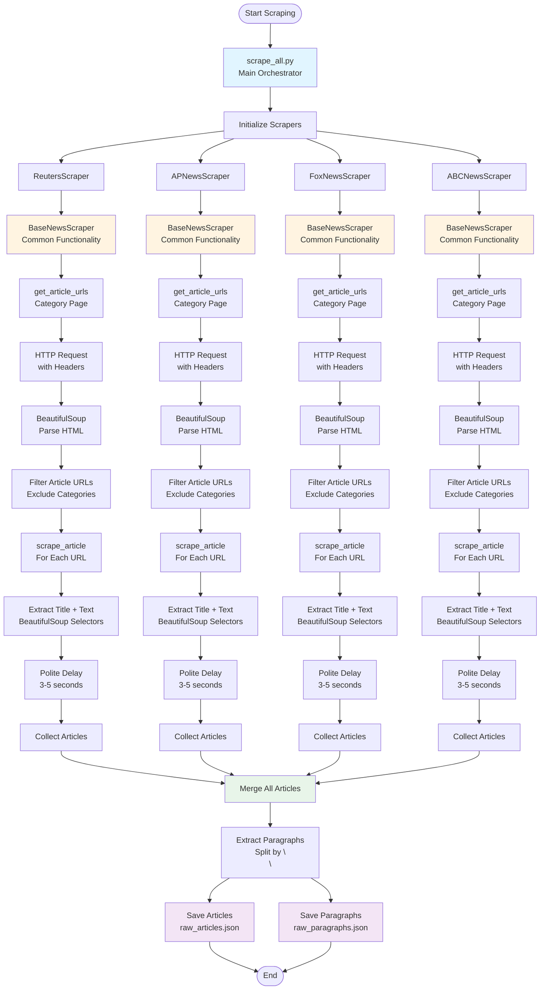
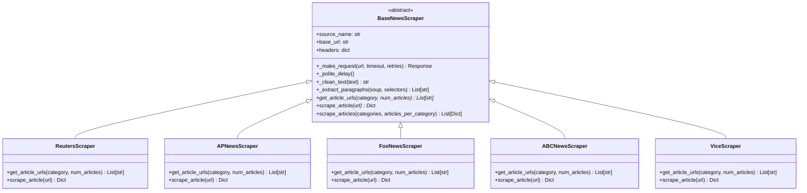
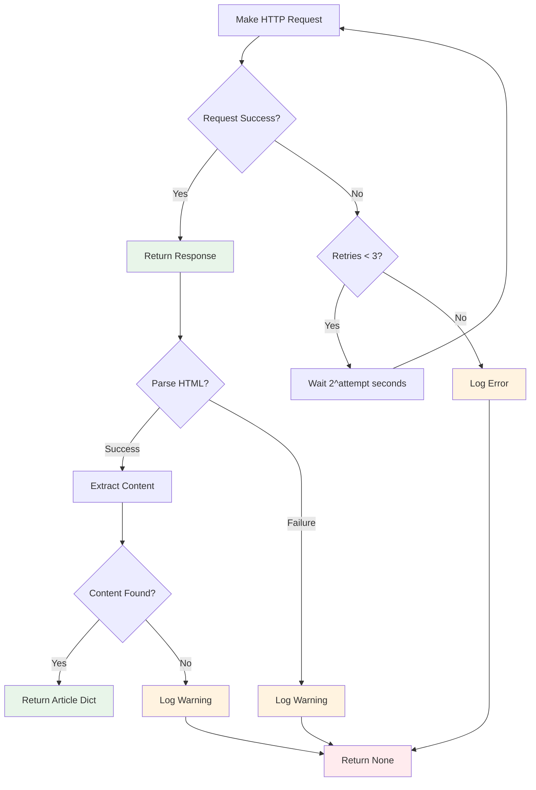

# News Scraping Architecture - Mermaid Diagram

## Scraping Workflow

```mermaid
flowchart TD
    Start([Start Scraping]) --> Main[scrape_all.py<br/>Main Orchestrator]
    
    Main --> InitScrapers[Initialize Scrapers]
    InitScrapers --> Reuters[ReutersScraper]
    InitScrapers --> APNews[APNewsScraper]
    InitScrapers --> FoxNews[FoxNewsScraper]
    InitScrapers --> ABCNews[ABCNewsScraper]
    
    Reuters --> Base1[BaseNewsScraper<br/>Common Functionality]
    APNews --> Base2[BaseNewsScraper<br/>Common Functionality]
    FoxNews --> Base3[BaseNewsScraper<br/>Common Functionality]
    ABCNews --> Base4[BaseNewsScraper<br/>Common Functionality]
    
    Base1 --> GetURLs1[get_article_urls<br/>Category Page]
    Base2 --> GetURLs2[get_article_urls<br/>Category Page]
    Base3 --> GetURLs3[get_article_urls<br/>Category Page]
    Base4 --> GetURLs4[get_article_urls<br/>Category Page]
    
    GetURLs1 --> Request1[HTTP Request<br/>with Headers]
    GetURLs2 --> Request2[HTTP Request<br/>with Headers]
    GetURLs3 --> Request3[HTTP Request<br/>with Headers]
    GetURLs4 --> Request4[HTTP Request<br/>with Headers]
    
    Request1 --> Parse1[BeautifulSoup<br/>Parse HTML]
    Request2 --> Parse2[BeautifulSoup<br/>Parse HTML]
    Request3 --> Parse3[BeautifulSoup<br/>Parse HTML]
    Request4 --> Parse4[BeautifulSoup<br/>Parse HTML]
    
    Parse1 --> Filter1[Filter Article URLs<br/>Exclude Categories]
    Parse2 --> Filter2[Filter Article URLs<br/>Exclude Categories]
    Parse3 --> Filter3[Filter Article URLs<br/>Exclude Categories]
    Parse4 --> Filter4[Filter Article URLs<br/>Exclude Categories]
    
    Filter1 --> Scrape1[scrape_article<br/>For Each URL]
    Filter2 --> Scrape2[scrape_article<br/>For Each URL]
    Filter3 --> Scrape3[scrape_article<br/>For Each URL]
    Filter4 --> Scrape4[scrape_article<br/>For Each URL]
    
    Scrape1 --> Extract1[Extract Title + Text<br/>BeautifulSoup Selectors]
    Scrape2 --> Extract2[Extract Title + Text<br/>BeautifulSoup Selectors]
    Scrape3 --> Extract3[Extract Title + Text<br/>BeautifulSoup Selectors]
    Scrape4 --> Extract4[Extract Title + Text<br/>BeautifulSoup Selectors]
    
    Extract1 --> Delay1[Polite Delay<br/>3-5 seconds]
    Extract2 --> Delay2[Polite Delay<br/>3-5 seconds]
    Extract3 --> Delay3[Polite Delay<br/>3-5 seconds]
    Extract4 --> Delay4[Polite Delay<br/>3-5 seconds]
    
    Delay1 --> Collect1[Collect Articles]
    Delay2 --> Collect2[Collect Articles]
    Delay3 --> Collect3[Collect Articles]
    Delay4 --> Collect4[Collect Articles]
    
    Collect1 --> Merge[Merge All Articles]
    Collect2 --> Merge
    Collect3 --> Merge
    Collect4 --> Merge
    
    Merge --> ExtractParas[Extract Paragraphs<br/>Split by \\n\\n]
    ExtractParas --> SaveArticles[Save Articles<br/>raw_articles.json]
    ExtractParas --> SaveParas[Save Paragraphs<br/>raw_paragraphs.json]
    
    SaveArticles --> End([End])
    SaveParas --> End
    
    style Main fill:#e1f5ff
    style Base1 fill:#fff4e1
    style Base2 fill:#fff4e1
    style Base3 fill:#fff4e1
    style Base4 fill:#fff4e1
    style Merge fill:#e8f5e9
    style SaveArticles fill:#f3e5f5
    style SaveParas fill:#f3e5f5
```

## Class Hierarchy

```mermaid
classDiagram
    class BaseNewsScraper {
        <<abstract>>
        +source_name: str
        +base_url: str
        +headers: dict
        +_make_request(url, timeout, retries) Response
        +_polite_delay()
        +_clean_text(text) str
        +_extract_paragraphs(soup, selectors) List[str]
        +get_article_urls(category, num_articles)* List[str]
        +scrape_article(url)* Dict
        +scrape_articles(categories, articles_per_category) List[Dict]
    }
    
    class ReutersScraper {
        +get_article_urls(category, num_articles) List[str]
        +scrape_article(url) Dict
    }
    
    class APNewsScraper {
        +get_article_urls(category, num_articles) List[str]
        +scrape_article(url) Dict
    }
    
    class FoxNewsScraper {
        +get_article_urls(category, num_articles) List[str]
        +scrape_article(url) Dict
    }
    
    class ABCNewsScraper {
        +get_article_urls(category, num_articles) List[str]
        +scrape_article(url) Dict
    }
    
    class ViceScraper {
        +get_article_urls(category, num_articles) List[str]
        +scrape_article(url) Dict
    }
    
    BaseNewsScraper <|-- ReutersScraper
    BaseNewsScraper <|-- APNewsScraper
    BaseNewsScraper <|-- FoxNewsScraper
    BaseNewsScraper <|-- ABCNewsScraper
    BaseNewsScraper <|-- ViceScraper
```

## Data Flow

```mermaid
flowchart LR
    A[Category Pages<br/>reuters.com/business<br/>foxnews.com/politics] --> B[HTTP Request<br/>with User-Agent]
    B --> C[HTML Response]
    C --> D[BeautifulSoup<br/>Parse HTML]
    D --> E[CSS Selectors<br/>Find Article Links]
    E --> F[Filter URLs<br/>Exclude Categories/Videos]
    F --> G[Article URLs<br/>List of URLs]
    
    G --> H[For Each URL]
    H --> I[HTTP Request<br/>Article Page]
    I --> J[HTML Response]
    J --> K[BeautifulSoup<br/>Parse Article]
    K --> L[Extract Title<br/>h1, .headline]
    K --> M[Extract Text<br/>p, .article-body]
    L --> N[Article Dict<br/>title, text, url, source]
    M --> N
    
    N --> O[Polite Delay<br/>3-5 seconds]
    O --> P[Next Article]
    P --> H
    
    N --> Q[All Articles<br/>List of Dicts]
    Q --> R[Extract Paragraphs<br/>Split by \\n\\n]
    R --> S[raw_articles.json<br/>Full Articles]
    R --> T[raw_paragraphs.json<br/>Individual Paragraphs]
    
    style A fill:#e3f2fd
    style G fill:#fff3e0
    style N fill:#e8f5e9
    style S fill:#f3e5f5
    style T fill:#f3e5f5
```

## Error Handling Flow

```mermaid
flowchart TD
    Start[Make HTTP Request] --> Try{Request Success?}
    Try -->|Yes| Success[Return Response]
    Try -->|No| Retry{Retries < 3?}
    Retry -->|Yes| Wait[Wait 2^attempt seconds]
    Wait --> Start
    Retry -->|No| LogError[Log Error]
    LogError --> ReturnNone[Return None]
    
    Success --> Parse{Parse HTML?}
    Parse -->|Success| Extract[Extract Content]
    Parse -->|Failure| LogParse[Log Warning]
    LogParse --> ReturnNone
    
    Extract --> CheckContent{Content Found?}
    CheckContent -->|Yes| ReturnArticle[Return Article Dict]
    CheckContent -->|No| LogNoContent[Log Warning]
    LogNoContent --> ReturnNone
    
    style Success fill:#e8f5e9
    style ReturnArticle fill:#e8f5e9
    style ReturnNone fill:#ffebee
    style LogError fill:#fff3e0
    style LogParse fill:#fff3e0
    style LogNoContent fill:#fff3e0
```

## Source-Specific Implementation

```mermaid
graph TB
    subgraph "BaseNewsScraper (Abstract Base Class)"
        A[Common Methods]
        A1[_make_request<br/>HTTP with retries]
        A2[_polite_delay<br/>3-5 sec random]
        A3[_clean_text<br/>Whitespace cleanup]
        A4[_extract_paragraphs<br/>Multiple selectors]
    end
    
    subgraph "FoxNewsScraper"
        B1[get_article_urls<br/>Exclude /category/]
        B2[scrape_article<br/>.article-body p]
    end
    
    subgraph "ViceScraper"
        C1[get_article_urls<br/>/en/article/ pattern]
        C2[scrape_article<br/>.article__body p]
    end
    
    subgraph "ReutersScraper"
        D1[get_article_urls<br/>data-testid='Link']
        D2[scrape_article<br/>data-testid='paragraph']
    end
    
    subgraph "APNewsScraper"
        E1[get_article_urls<br/>/article/ pattern]
        E2[scrape_article<br/>data-key='articleBody']
    end
    
    subgraph "ABCNewsScraper"
        F1[get_article_urls<br/>/story?id= pattern]
        F2[scrape_article<br/>data-test-locator='paragraph']
    end
    
    A --> A1
    A --> A2
    A --> A3
    A --> A4
    
    A -.inherits.-> B1
    A -.inherits.-> B2
    A -.inherits.-> C1
    A -.inherits.-> C2
    A -.inherits.-> D1
    A -.inherits.-> D2
    A -.inherits.-> E1
    A -.inherits.-> E2
    A -.inherits.-> F1
    A -.inherits.-> F2
    
    style A fill:#fff4e1
    style B1 fill:#e1f5ff
    style C1 fill:#e1f5ff
    style D1 fill:#e1f5ff
    style E1 fill:#e1f5ff
    style F1 fill:#e1f5ff
```

